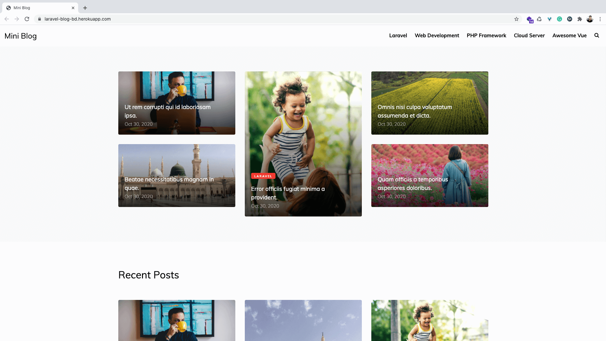
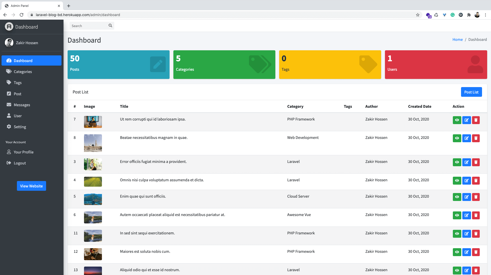

# Laravel Complete Blog Development
This is a Blog Development Tutorial Series on Youtube. This project is made by <a href="https://zakirhossen.com" target="_blank">Zakir Hossen</a> for the tutorial Purpose.

## Tutorial Link
- [Series Prview Link](https://www.youtube.com/watch?v=CEYYeeM763E&list=PLl4v4A2HI0YixTm5AsoTu-sKxiQti4-r6&index=1&t=1s)
- [Youtube Playlist Link](https://www.youtube.com/playlist?list=PLl4v4A2HI0YixTm5AsoTu-sKxiQti4-r6)

## Project Live Link
[Live Link ⇨ ](https://laravel-blog-bd.herokuapp.com/)

#### Project Key Matrics
- Laravel v7.0
- Frontend Template [(MiniBlog by Colorlib)](https://colorlib.com/wp/template/miniblog/)
- Admin Template [(Admin LTE 3)](https://adminlte.io/themes/dev/AdminLTE/index.html)


#### Frontend Screenshot


#### Backend Screenshot


#### Setup Project
```bash
# clone the repo
git clone https://github.com/devzakir/laravel-complete-blog-development.git laravel-blog

# install composer dependency
composer install

# create a environment file
cp .env.example .env

# set the Application key
php artisan key:generate

# comment database query in AppServiceProvider.php like this
// $categories = Category::take(5)->get();
// View::share('categories', $categories);

// $setting = Setting::first();
// View::share('setting', $setting);

# setup the database credentials and migrate database with seeders
php artisan migrate --seed

# enable the database query code in AppServiceProvider.php like this
$categories = Category::take(5)->get();
View::share('categories', $categories);

$setting = Setting::first();
View::share('setting', $setting);
```


